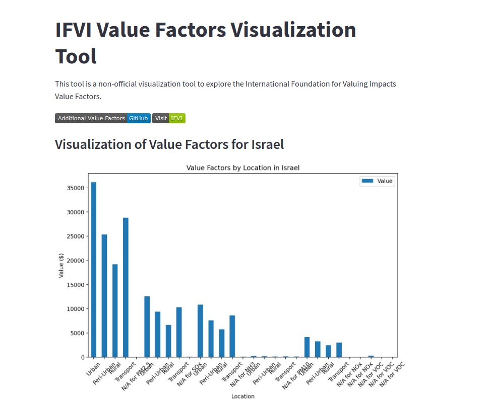
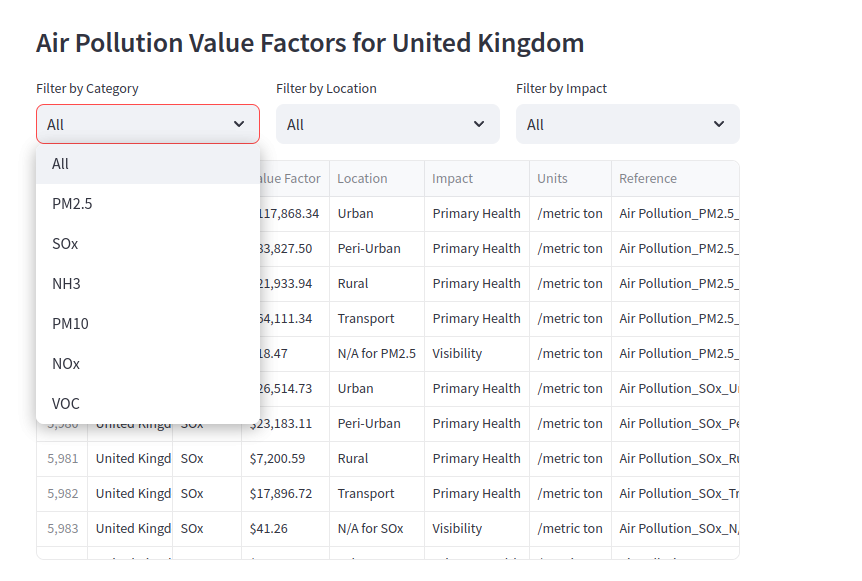
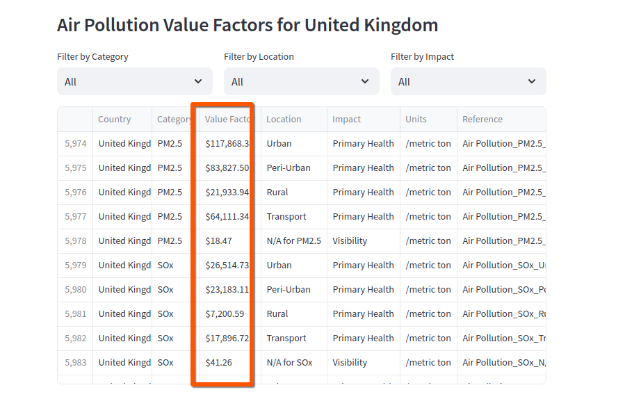
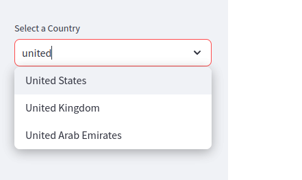
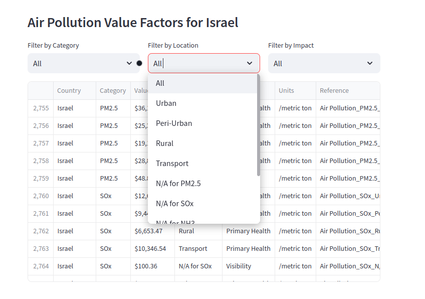

 # Streamlit Deployment Repository: IFVI Value Factors Visualization Tool (Non-Official)

 

 [](https://valuefactorsddatavis.streamlit.app/)

## Data Source (Submodule)

 [](https://github.com/danielrosehill/Global-Value-Factors-Explorer)

Welcome to the deployment repository for the **Streamlit app** that visualizes the value factors released by the [International Foundation for Valuing Impacts](https://ifvi.org) (IFVI). This app provides an interactive interface for exploring these value factors, allowing users to filter by country and explore them by category.

## Overview

This repository is dedicated to deploying the Streamlit application that enables users to interact with the IFVI value factors. These factors are part of the Global Value Factors Database, released in late 2024 during UN Climate Week. They offer a comprehensive method for companies to convert their environmental impacts into monetary terms, supporting impact accounting practices.

### Key Features

- **Interactive Visualization**: Navigate through value factors using a user-friendly interface.
- **Country and Category Filtering**: Easily filter value factors by specific countries and categories.
- **Impact Accounting Support**: Provides tools for integrating environmental impacts into financial reporting.

## Related Repositories

- **Global Value Factors Explorer Repository**: This separate repository contains the source data for these visualizations. It provides a derivative dataset based on the official IFEI data.
- **Documentation Repository**: Contains detailed documentation for the derivative database used in this visualization project.

## About The IFVI Value Factors

The IFVI value factors are geographically stratified multipliers designed to be paired with quantitative data, facilitating their integration into financial reporting. They serve as a potential bridge between traditional accounting methods and the inclusion of social and environmental impacts in financial analysis.

[](https://ifvi.org)

## Disclaimer

This project is a non-official undertaking. For the latest information and official documentation about the IFEI value factors, please visit their website at [ifvi.org](http://ifvi.org).

## How To Clone This Repository Locally

To run this Streamlit app locally or deploy it on your preferred platform, follow these steps:

1. **Clone this repository**:
   ```bash
   git clone https://github.com/yourusername/ifei-value-factors-streamlit.git
   ```
2. **Install dependencies**:
   ```bash
   pip install -r requirements.txt
   ```
3. **Run the Streamlit app**:
   ```bash
   streamlit run app.py
   ```

## Screenshots - Exploring Air Pollution Data










## Author

Daniel Rosehill  
(public at danielrosehill dot com)

## Licensing

This repository is licensed under CC-BY-4.0 (Attribution 4.0 International) 
[License](https://creativecommons.org/licenses/by/4.0/)

### Summary of the License
The Creative Commons Attribution 4.0 International (CC BY 4.0) license allows others to:
- **Share**: Copy and redistribute the material in any medium or format.
- **Adapt**: Remix, transform, and build upon the material for any purpose, even commercially.

The licensor cannot revoke these freedoms as long as you follow the license terms.

#### License Terms
- **Attribution**: You must give appropriate credit, provide a link to the license, and indicate if changes were made. You may do so in any reasonable manner, but not in any way that suggests the licensor endorses you or your use.
- **No additional restrictions**: You may not apply legal terms or technological measures that legally restrict others from doing anything the license permits.

For the full legal code, please visit the [Creative Commons website](https://creativecommons.org/licenses/by/4.0/legalcode).